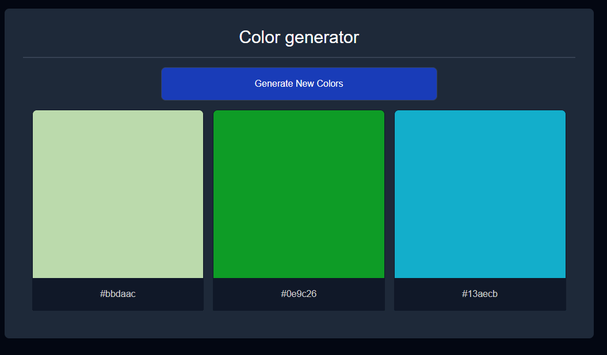
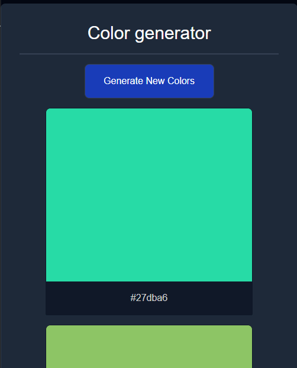

# 🎨 Random Color Generator

A simple JavaScript-based color generator that creates three random colors and displays their hex codes. Users can refresh the colors by clicking a button.

## 📸 Preview

### Web View:



### Mobile View:



## 🚀 Features

- Generates three random colors at a time.
- Displays hex codes of generated colors.
- Works on both desktop and mobile.
- Simple and lightweight JavaScript implementation.

## 🛠️ Installation & Usage

1. **Clone the Repository**
   ```sh
   git clone https://github.com/preslaviliev93/Mini-Javascript-Projects.git
   ```
