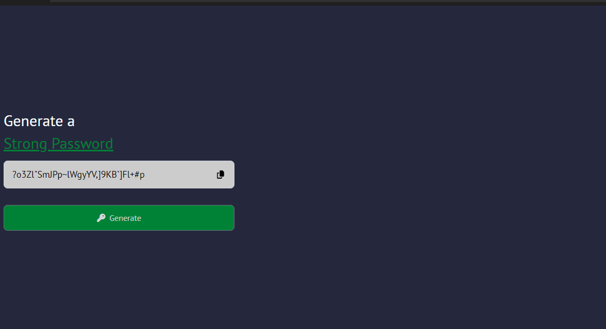

# 🔒 Strong Password Generator

A simple yet powerful password generator built with **JavaScript** and **TailwindCSS**. Generates **random 30-character passwords** using ASCII characters to ensure security.

## 📸 Preview



## 🚀 Features

✅ Generates strong **30-character** passwords  
✅ Uses **ASCII characters** for a wide range of symbols  
✅ **Copy button** to quickly copy the password  
✅ Simple and **modern UI** with **TailwindCSS**  
✅ Fully **responsive** for mobile and desktop

## 🎯 How It Works

1. Click the **"Generate"** button to create a random password.
2. The generated password appears in the input field.
3. Click the **copy icon** 📋 to copy it to the clipboard.

## 🛠️ Technologies Used

- **HTML5**
- **CSS3 + TailwindCSS**
- **JavaScript (Vanilla)**

## 🖥️ Installation & Usage

1. **Clone the repository**
   ```sh
   git clone https://github.com/preslaviliev93/Mini-Javascript-Projects.git
   ```
