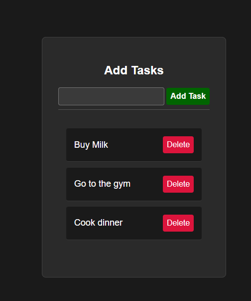

# Basic To-Do App

This is a beginner-friendly **To-Do App** built with **HTML**, **CSS**, and **JavaScript**. It allows users to add, display, and delete tasks. Tasks persist across page reloads using **localStorage**.

## Features

- Add tasks with a simple input field.
- View tasks in a styled list.
- Mark tasks as completed by clicking on them.
- Delete tasks with a dedicated button.
- Tasks are saved to **localStorage**, so they persist even after refreshing the page.

---

## Demo

Here’s how the app looks:



---

## Technologies Used

- **HTML**: Structure of the app.
- **CSS**: Styling the app with a clean and minimal design.
- **JavaScript**: Core logic for adding, removing, and persisting tasks.

---

## Installation

1. Clone this repository:
   ```bash
   git clone https://github.com/preslaviliev93/Mini-Javascript-Projects.git
   ```
